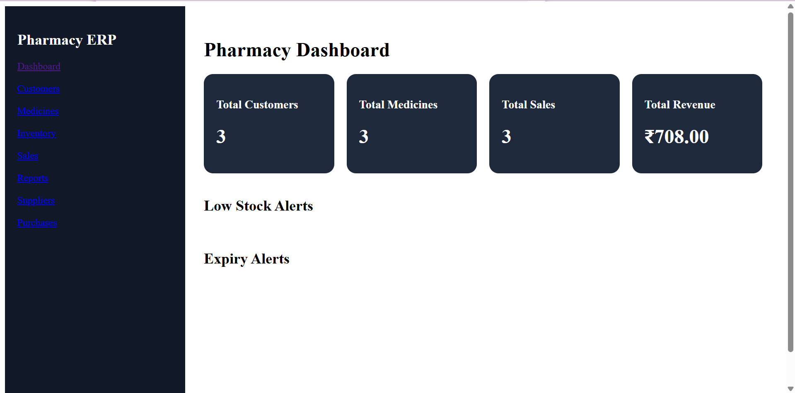
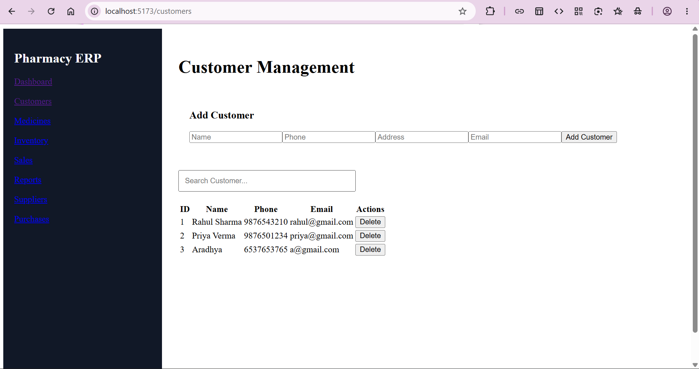
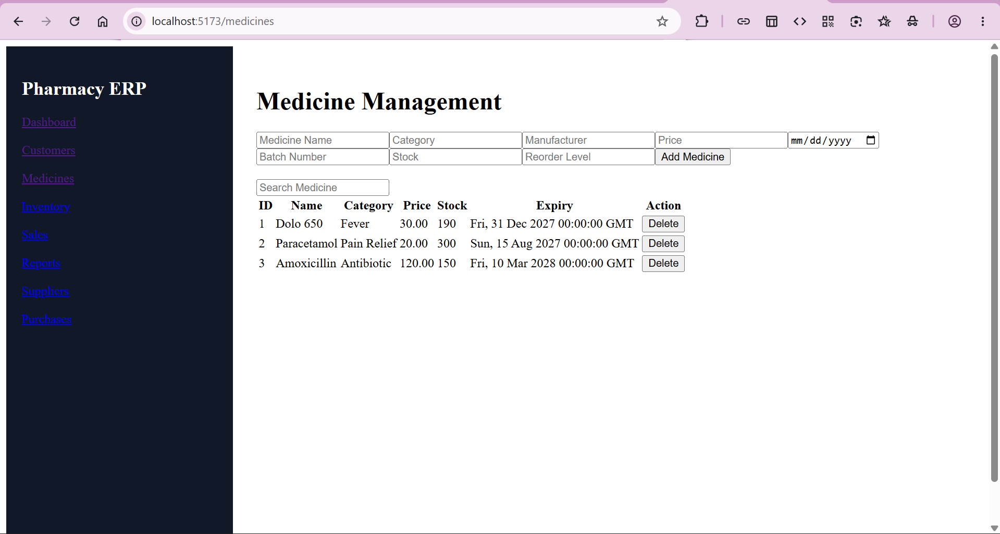
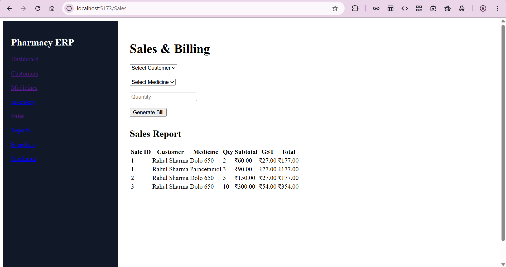
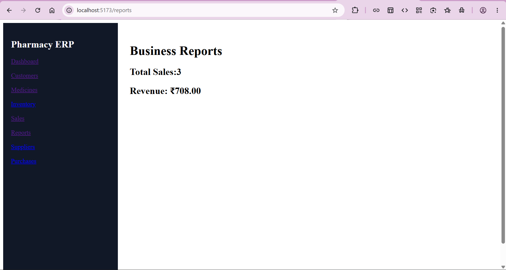

# 💊 Pharmacy Management ERP System

A full-stack Pharmacy Management ERP System built using **React, Flask, MySQL, Stored Procedures, Triggers, Views, and JWT Authentication**.

This application helps pharmacies manage medicines, inventory, suppliers, purchases, sales, billing, customers, and business analytics through a centralized web platform.

---

# 🚀 Features

## Dashboard & Analytics

* Real-time business dashboard
* Total Revenue Tracking
* Total Sales Monitoring
* Total Customers Overview
* Total Medicines Overview
* Low Stock Alerts
* Expiry Alerts

## Customer Management

* Add Customers
* View Customer Records
* Customer Purchase History

## Medicine Management

* Add Medicines
* Update Medicine Details
* Medicine Search
* Batch Tracking
* Expiry Management

## Inventory Management

* Stock Monitoring
* Reorder Level Alerts
* Automatic Stock Updates
* Inventory Status Reports

## Sales & Billing

* Create Sales Transactions
* Generate Bills
* Calculate Grand Total
* Customer Purchase Tracking

## Supplier Management

* Add Suppliers
* View Supplier Information
* Supplier Purchase Tracking

## Purchase Management

* Purchase Medicines from Suppliers
* Automatic Inventory Updates using Triggers
* Purchase History

## Authentication & Security

* User Login
* Role-Based Access Control
* JWT Authentication
* Admin & Pharmacist Roles

## Audit Logging

* User Activity Tracking
* Customer Creation Logs
* Medicine Creation Logs
* Purchase Logs
* Sales Logs

---

# 🛠 Tech Stack

### Frontend

* React
* TypeScript
* Axios
* React Router

### Backend

* Flask
* Python
* JWT Authentication

### Database

* MySQL

### Database Concepts Used

* Stored Procedures
* Triggers
* Views
* Foreign Keys
* Joins
* Transactions

---

# 📸 Application Screenshots

## Dashboard



---

## Customer Management



---

## Medicine Management



---

## Sales & Billing





---


# 🏗 Database Architecture

## Core Tables

* Users
* Customers
* Medicines
* Inventory
* Suppliers
* Purchases
* Sales
* Bills
* AuditLogs

---

## Stored Procedures

* Add Sale
* Generate Bill
* Inventory Updates
* Revenue Calculations

---

## Triggers

### Inventory Reduction

Automatically reduces stock after medicine sales.

### Inventory Increase

Automatically increases stock after purchases.

### Audit Logging

Tracks critical business operations.

---

## Views

### Dashboard Summary View

Provides dashboard statistics.

### Inventory Status View

Displays current inventory conditions.

### Low Stock View

Displays medicines requiring replenishment.

### Sales Report View

Displays customer sales information.

### Supplier Purchase View

Displays supplier purchasing history.

---

# 📂 Project Structure

```text
pharmacy-management/
│
├── frontend/
│   ├── src/
│   ├── public/
│   └── package.json
│
├── backend/
│   ├── app.py
│   ├── requirements.txt
│   └── config.py
│
├── database/
│   ├── schema.sql
│   ├── procedures.sql
│   ├── triggers.sql
│   ├── views.sql
│   └── sample_data.sql
│
├── screenshots/
│
└── README.md
```

# ⚙️ Installation

## Clone Repository

```bash
git clone https://github.com/sneha-65/pharmacy_management.git

cd pharmacy_management
```

## Database Setup

Run SQL files in MySQL Workbench:

```text
schema.sql
procedures.sql
triggers.sql
views.sql
sample_data.sql
```

## Backend Setup

```bash
cd backend

pip install -r requirements.txt

python app.py
```

Backend will run on:

```text
http://127.0.0.1:5000
```

## Frontend Setup

```bash
cd frontend

npm install

npm run dev
```

Frontend will run on:

```text
http://localhost:5173
```

---

# 🔐 Default Login

## Admin

```text
Username: admin
Password: admin123
```

## Pharmacist

```text
Username: pharmacist
Password: pharmacist123
```

---

# 📊 Business Workflow

```text
Supplier
   ↓
Purchase Medicines
   ↓
Inventory Updated
   ↓
Medicine Available
   ↓
Customer Purchase
   ↓
Sales Created
   ↓
Bill Generated
   ↓
Inventory Reduced
   ↓
Audit Log Recorded
```

---

# 🎯 Learning Outcomes

This project demonstrates:

* Full Stack Development
* REST API Development
* Database Design
* Stored Procedures
* Triggers
* Views
* Authentication & Authorization
* Business Process Automation
* ERP System Design
* Inventory Management

---

# 👨‍💻 Author

Developed as a Full Stack Pharmacy ERP System project using React, Flask, and MySQL.

---

# ⭐ Future Enhancements

* PDF Invoice Generation
* Excel Export
* Advanced Charts & Analytics
* SMS Notifications
* Email Notifications
* Barcode Scanning
* Multi-Branch Pharmacy Support
* Cloud Deployment
* Mobile Application

```
```
